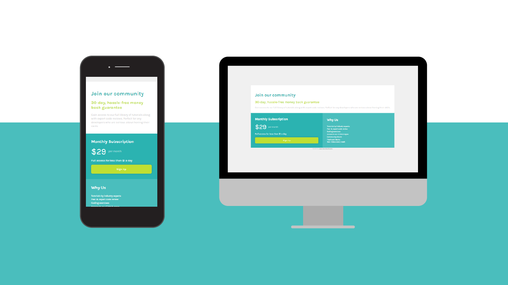

# Make It Real - Single price grid component

This is a solution to the Single price grid component project of the Make It Real course.

## Table of contents

- [Overview](#overview)
  - [The challenge](#the-challenge)
  - [Screenshot](#screenshot)
- [My process](#my-process)
  - [Built with](#built-with)
  - [What I learned](#what-i-learned)
  - [Continued development](#continued-development)
  - [Useful resources](#useful-resources)
- [Author](#author)
- [Acknowledgments](#acknowledgments)

## Overview

### The challenge

Users should be able to:

- Build a team website based on a plain image design
- Adapt css styling to be responsive

### Screenshot



## My process

To begin with, we analized the image proposed as design to identify the structural elements for HTML file. Then we applied that structure to the HTML file. Later, we applied styling with css for the mobile design. Finally we applied the required modifications for the desktop design.

### Built with

- Semantic HTML5 markup
- CSS custom properties
- Flexbox
- Mobile-first workflow

### What I learned

I remembered a couple of handy css properties:

```css
.gray-p {
  color: rgba(0, 0, 0, 35%);
  line-height: 1.4;
}

#why-list {
  list-style: none;
}
```

### Continued development

I need to keep working on flex properties. Also, I have to learn the arguments of the box-shadow property.

### Useful resources

- [Box Shadow Generator](https://www.cssmatic.com/box-shadow) - This helped me to set the propper box shadow.
- [Image Color Picker](https://imagecolorpicker.com) - This helped me to get the exact color values from the design.

## Author

- [LinkedIn](https://www.linkedin.com/in/juan-orjuela/)
- [Behance](https://www.behance.net/juan_o)

## Acknowledgments

Special aknowledgments to Yulany Munévar and Julián Gómez, coding partners on this task, and to [Cristian Moreno](https://github.com/khriztianmoreno), teacher and mentor for supervising our process.

